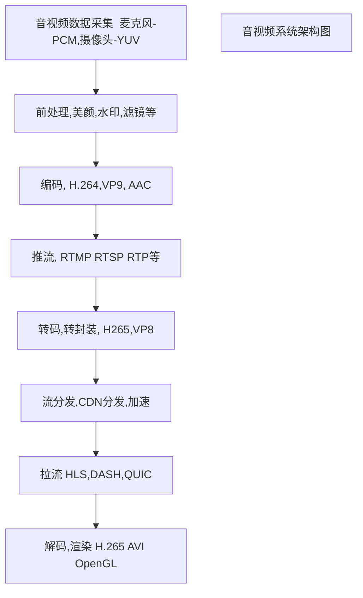

音视频技术框架
=================

## 音视频系统架构

```mermaid
graph TD
1[音视频数据采集  麦克风-PCM,摄像头-YUV] --> 2[前处理,美颜,水印,滤镜等]
2 --> 3[编码, H.264,VP9, AAC]
3 --> 4[推流, RTMP RTSP RTP等]
4 --> 5[转码,转封装, H265,VP8]    
5 --> 6[流分发,CDN分发,加速]
6 --> 7[拉流 HLS,DASH,QUIC]
7 --> 8[解码,渲染 H.265 AVI OpenGL]
    900[音视频系统架构图]
```

