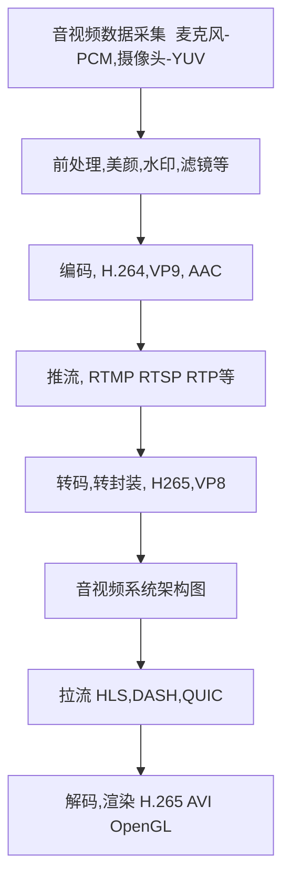

音视频技术框架
=================

## 音视频系统架构

```mermaid
graph TD
A[音视频数据采集  麦克风-PCM,摄像头-YUV] --> B[前处理,美颜,水印,滤镜等]
B --> C[编码, H.264,VP9, AAC]
C --> D[推流, RTMP RTSP RTP等]
D --> E[转码,转封装, H265,VP8]    
E --> F[流分发,CDN分发,加速]
F --> G[拉流 HLS,DASH,QUIC]
G --> H[解码,渲染 H.265 AVI OpenGL]
    F[音视频系统架构图]
```

